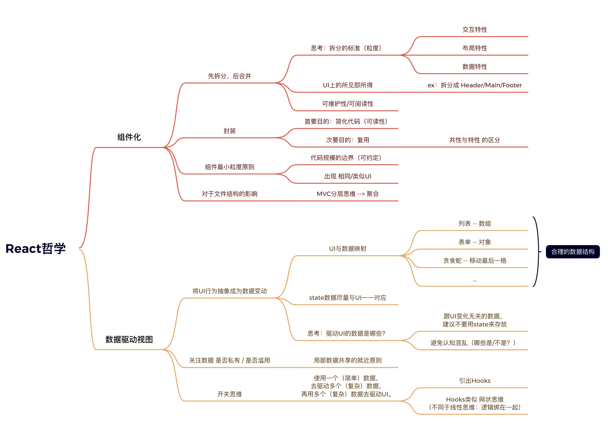

React

# 1 React 概念

###1.1 组件化概念

组件的特点：

- 可组合
- 可重用
- 可维护，每个组件仅包含自身逻辑，方便维护

# 2 JSX 语法

###2.1 虚拟 DOM

- 简介

  react 利用 Babel，将 JSX 语法在编译阶段编译成 js 对象，然后在执行阶段再执行函数，生成真实 DOM

- 虚拟 DOM 生成过程

  ```javascript
  ReactDOM.render(<h1 title='title'>Hello, World</h1>, document.getElementById('root'));

  // 在上述jsx语句中，利用babel会编译成
  ReactDOM.render( /*#__PURE__*/
    React.createElement("h1", {title: "title"}, "Hello, World"), document.getElementById('root')
  );
  // 然后生成虚拟DOM
  {
    type: 'h1',
    props: {
      title: 'title'
      children: 'Hello, World'
    }
  }
  ```

- 虚拟 DOM 中的 children

  虚拟 DOM 中的 children

# React Hooks

> React Hooks 理念参考视频：
>
> https://www.bilibili.com/video/BV1Ge411W7Ra?from=search&seid=8648670450944923695
>
> React Hooks 面试参考视频：
>
> https://www.bilibili.com/video/BV1cE411i7F1/?spm_id_from=333.788.recommend_more_video.-1
>
> React Hooks 函数式因变量自变量理解
>
> https://www.bilibili.com/video/BV1JU4y1E73v/?spm_id_from=333.788.recommend_more_video.10

简单笔记

react hooks 是用于帮助函数式组件管理状态以及一些异步操作的东西

## 理念

####传统逻辑

先从传统逻辑看起，假设要控制一个弹框的展示，按照传统逻辑，需要进行如下操作

1. 先 document.getElementById 获取弹框组件的 DOM 对象
2. 然后，通过设置类名 class，来控制弹框的展示与否

在这种方式下，如果交互变得复杂起来，那么就需要控制大量的 DOM，非常难以维护

####现代逻辑

在上述传统逻辑下，诞生了现代逻辑下的核心思想——**数据驱动视图**

还是上述的弹框例子，因为 react 区分了数据层和 UI 层，那么，当数据发生变化，就会自动驱动视图 UI 发生改变，所以后续只需要更多关注数据的变化即可



### hooks

要理解 react hooks，首先，要先理解几个概念。

UI 可以理解为**视图，数据，行为**的结合，视图就是最终渲染后展示给用户看的页面，数据就是用于填充视图的内容，行为，则是在视图上出现的各种能对状态进行改变的方式。

视图对应界面，数据对应状态及状态的改变，而行为，就是各种 hooks

有极大影响。是状态驱动视图进行改变，而不在视图上展示的内容，比如 console.log 等，则称之为作用。

**\#hooks 的函数式理解**（卡颂版）

useState, useReducer, useContext 都是自变量，会自身改变

useMemo, useCallback 属于因变量，因自变量改变而改变

useEffect 属于副作用

useRef 属于自变量引起视图更新等的过程中，起到一个监控作用

## useState

**思想**

_useState 的思想：因为 hooks 的核心逻辑是**数据驱动视图**，所以，使用 state 存放的数据有自身的特性，那就是能够驱动对应的 UI 发生变化，而其他与 UI 变化没有关系的数据，就尽量不要使用 state 来存放_

1. 说明：

   管理状态方面，有 useState 函数，直接写在函数式组件当中，入参是当前需要存储的状态的初始值，返回值是一个数组，第一项是对应的状态名，第二项是对状态的管理函数，例如

   ```typescript
   const [count, setCount] = useState(0);
   ```

   意思即为保存一个名为 count 的状态，初始值为 0，且给与其一个 setcount 的变化函数，如需改变 count 值，则可以使用 setCount

2. **注意点**：有时候因为取不到最新的值的关系，setCount 可能会一直拿 count 的初始值进行操作，此时可以改写成：

   ```typescript
   const [count, setCount] = useState(0);
   setCount(count++); // 不推荐
   setCount((count) => count + 1); // 设置函数定义域，推荐
   ```

## useEffect

**思想**

_useEffect 的思想：可以理解为是超脱于视图之外的一些行为，比如 console.log，这些东西不会影响到视图的变化，但是却在后台默默影响，这类行为被称为副作用 effect，副作用可以有依附值，依附于谁而变，如果依附一个常量，那么就只会调用一次，因为常量并不会发生状态的变化_，所以，useEffect 可以当做 componentDidMount 来使用

1. 说明：

   useEffect 参数为函数，他可以返回一个函数，返回的函数将会在组件被重新渲染之后执行，类似 componentWillUnmount，它还可以传入第二个参数，例如[count]， 用于监听，当 Mount 状态发生改变的时候，才会进行调用，而不是每次页面刷新都进行一次新的调用

2. 代码示例：

   ```typescript
   useEffect(() => {
     // 更新文档的标题
     document.title = `You clicked ${count} times`;
   }, [count]);
   ```

> 详细笔记待补充

## useLayoutEffect

与上面的 useEffect 类似，

## useContext

> 参考文档：
>
> https://blog.csdn.net/weixin_43606158/article/details/100750602

**思想**

_useContext 的思想，可以理解为是一种大家共知共解的一种背景关系，在这个大背景下，其中的一些公共的知识，公共的方法，都是被大家所熟知的，例如：大背景是现代社会，那么这个大背景下，会存在诸如玩手机等方法，也存在身高、体重等属性，每个需要这些方法和属性的人，都可以直接通过大背景.属性的方式进行调用_

1. 说明：useContext 意思是创建上下文，在代码中一般用于给不同的组件之间传递一些公共的值，实现组件中的值共享

2. 简而言之的使用思路

   ① 先 createContext()创建一个上下文环境

   ② 使用 provider 包裹住子组件并传值

   ③ 子组件使用 useContext 指定上下文后，解构出所需的值直接使用

3. 代码实现如下：

   ```typescript
   // 要使用上下文，第一步就是先创建一个上下文，当然，其中是可以传值的
   const TestContext = React.createContext({});

   // 第二步，使用上下文提供的provider，实现定义共享的一些上下文值，并且包裹住需要使用这些值的子组件
   function App() {
     return (
       <TestContext.Provider
         value={{
           username: 'superawesome',
       		toggle: ()=>{
       			console.log('Im a function');
     			}
         }}
       >
         <div className="test">
           <Navbar />		// 此处Navbar和Messages被上下文包裹，可以直接拿到上下文提供的username
           <Messages />
         </div>
       <TestContext.Provider/>
     );
   }

   // 第三步，子组件中从上下文中解构出所需的参数，并使用
   const Navbar = () => {
     const { username } = useContext(TestContext)	// 此处useContext需要指明获取的是哪个context的值，因为组件可以同时被多个context包裹
     return (
       <div className="navbar">
         <p>{username}</p>
       </div>
     )
   }
   // 同理，另一个子组件也可以获取到所需的参数
   const Messages = () => {
     const { username } = useContext(TestContext)

     return (
       <div className="messages">
         <p>1 message for {username}</p>
       </div>
     )
   }
   ```

## useReducer

1. 说明

   useRududer 类似于 useState，但是 state 仅仅单独设置值，但是 useReducer 可以根据 dispatch 进来的不同值进行不同的一番处理

2. 使用方法

   ① 引入 useReducer

   ② 声明 useReducer，其中包含了两个参数，第一个 reducer 是处理数据的 reducer 函数，第二个是初始值，初始值可为基本数据类型，也可为函数或对象。其中，const 两个参数，一个是数据变量本身，一个是 dispatch 方法，用于给 reducer 函数传入不同的类型

   ③ 在需要改变数据变量的时候，触发 dispatch 事件，传入不同的 type 值

   ④ 编写 reducer 函数，reducer 函数接收两个参数，第一个是 state，状态值，也就是 useReducer 中的第二个参数，第二个是 action，是 dispatch 传过来的参数

   ⑤ 使用 switch...case...进行不同逻辑不同处理，将 state 的新值以返回值的形式返回出去即可

3. 代码示例如下

   ```typescript
   import { useReducer } from "react";

   function reducer(state, action) {
     // 注意，顺序一定不能反！！！
     console.log(state); // {count:0}，此处state为useReducer第二个参数初始值
     console.log(action); // {type:'plus'/'minus'}， 此处为dispatch中传入的参数
     switch (action.type) {
       case "plus":
         return {
           // 返回值要是新的state的值，所以一定要和state的数据结构保持一致，底下state为number，那么返回值也要是一个number，如果是一个Object，那么返回值也要是一个Object
           count: state.count + 1,
         };
       case "minus":
         return {
           count: state.count - 1,
         };
       default:
         throw "...";
     }
   }

   export default function ReducerDemo() {
     // const第一个参数为变量名，第二个为dispatch函数
     // useReducer第一个参数为reducer函数，可以直接写，也可以抽出去，第二个为counter的初始值
     const [counter, dispatch] = useReducer(reducer, { count: 0 });
     return (
       <div>
         <div>counter is {counter.count}</div>
         <button onClick={() => dispatch({ type: "plus" })}>plus</button>
         <button onClick={() => dispatch({ type: "minus" })}>minus</button>
         // 上面的dispatch写成的是返回值的形式，也可以将dispatch写进函数体，也能实现，如下
         <button
           onClick={() => {
             dispatch({ type: "plus" });
           }}
         >
           plus
         </button>
         <button
           onClick={() => {
             dispatch({ type: "minus" });
           }}
         >
           minus
         </button>
       </div>
     );
   }
   ```

## useRef

1. 说明

   useRef 一般由两种用法，要么用来操作 DOM，要么用于保持变量的引用

2. 功能

   比如，点击按钮，获取 input 框的焦点。还可以用于父子组件传值，父组件调用子组件的方法

## useMemo

> 1. useMemo 和 useEffect: https://www.jianshu.com/p/94ace269414d
>
> 2. useMemo 和 useCallback: https://blog.csdn.net/sinat_17775997/article/details/94453167

1. 说明

   useMemo 和 useCallback 都会在组件第一次渲染的时候执行，之后会在其依赖的变量发生改变时再次执行（**因为组件挂载时只调用一次，所以，可以解决某些逻辑重复运行的问题，提高性能**）；并且这两个 hooks 都返回缓存的值，useMemo 返回缓存的变量，useCallback 返回缓存的函数。

2. 功能

   可以实现和 useSate 类似的功能，如上面描述。此外，useMemo 保存的数据可以当做缓存

3. **useEffect 和 useMemo**

   useMemo 和 useEffect 写法类似，可见下。

   useMemo 和 useEffect 的区别在于，**useMemo 是在渲染时触发的，useEffect 是渲染后触发的**

   所以！**在 useMemo 中不能进行 setState 的操作！**，因为 usememo 是渲染时触发，而 setstate 会再次触发渲染造成死循环。

   按生命周期理解的话，**useMemo 相当于 shouldComponentUpdate，useEffect 相当于 componentDidMount**

   ```typescript
   import { useState, useMemo, useEffect } from "react";

   export default function ReducerDemo() {
     const [name, setName] = useState("bill");
     const [age, setAge] = useState(20);

     const memolize = useMemo(() => {
       console.log("name change for memo");
     }, [name]);

     useEffect(() => {
       console.log("name change for effect");
     }, [name]);

     return (
       <div>
         {memoDemo}
         count is {count} right now
         <button
           onClick={() => {
             setAge((age) => age + 1);
           }}
         >
           add
         </button>
       </div>
     );
   }

   // 在此案例中，点击按钮，造成age的+1，会触发effect的更新，因为effect是在页面渲染后执行，age更新触发页面更新，页面更新带动name更新，所以会带动effect更新，但是useMemo是在渲染过程中执行的，所以并不会被触发
   ```

## useCallback

笔记待补充

## memo, effect, callback 区别

> 三者区别：
>
> 参考文档：https://juejin.cn/post/7008433550307360798

## 父子组件通信

> https://www.cnblogs.com/art-poet/p/13269408.html

### 子组件调用父组件方法

```js
// 父组件方法
const changePage = (type) => {
  console.log(type);
};
// 父组件jsx部分
<PageChange currentPage={currentPage} changePage={changePage}></PageChange>;

// 子组件props接受方法
const { changePage } = props;

// 子组件jsx，利用bind可以进行传参
<div className={ss.changeBtn} onClick={changePage.bind(this, "next")}>
  下一页
</div>;
```

### 父组件调用子组件方法

使用 useRef

# React 开发过程中碰到的问题

###函数式组件 input 失焦

问题详述：函数式组件中，input 输入某些内容，根据输入的内容控制改组件某个子组件的展示，因为子组件的添加触发了父组件的更新渲染，会导致 input 的键盘收回

问题代码片段：

```jsx
const [show, setShow] = useState(false);

return (
	<div>
    <input onChange(e=>{ setShow(true) }) />
    <Son1></Son1>
    show && (<Son2></Son2>)
	<div>
)

 // 该案例中，因为input变化，setShow为true，导致组件Son2被渲染，触发组件更新，键盘被收回
```

解决办法：

令子组件自行控制自己的展示与否，这样就不会波及到父组件的更新，相关代码片段如下

```jsx
const [show, setShow] = useState(false);

return (
	<div>
    <input onChange(e=>{ setShow(true) }) />
    <Son1></Son1>
    <Son2 isShow={show}></Son2>
	<div>
)
```
